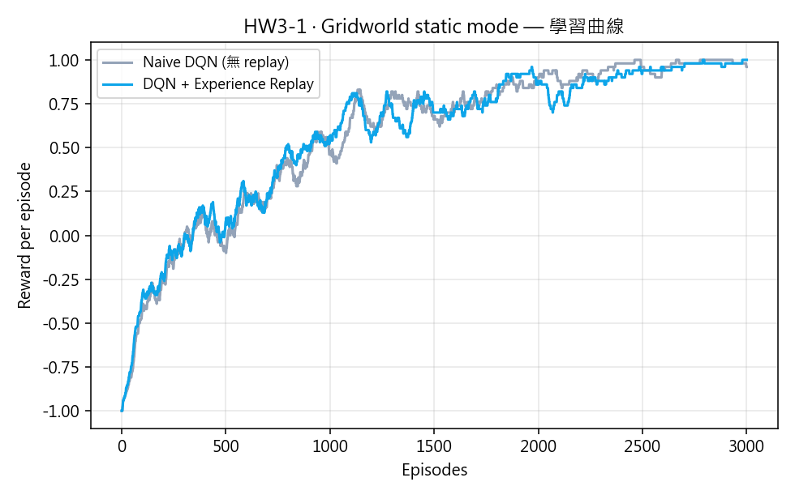
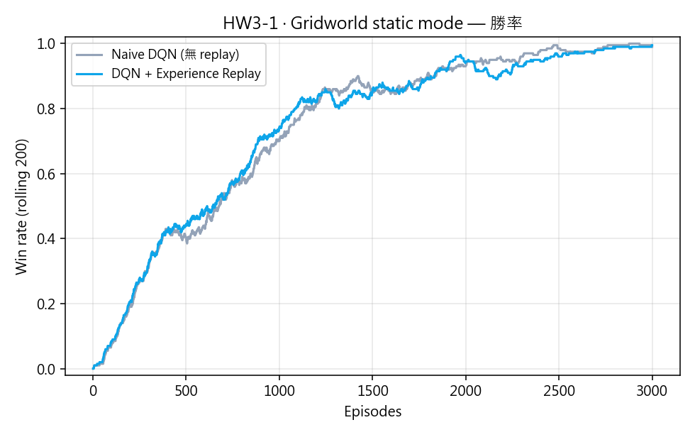
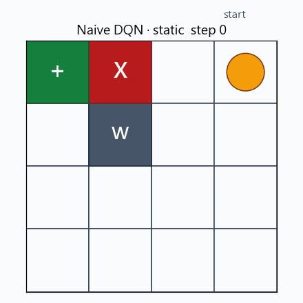
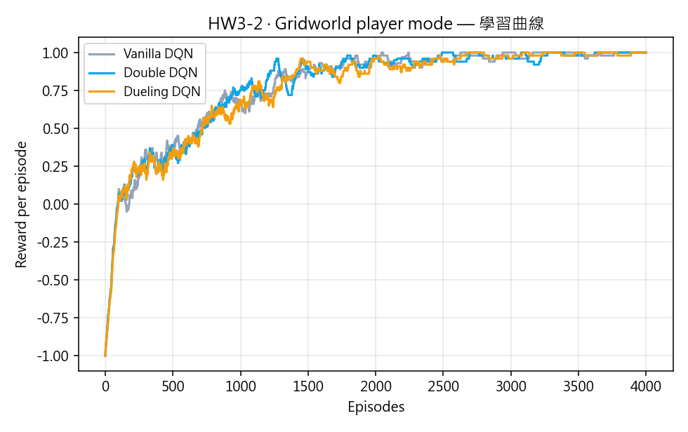
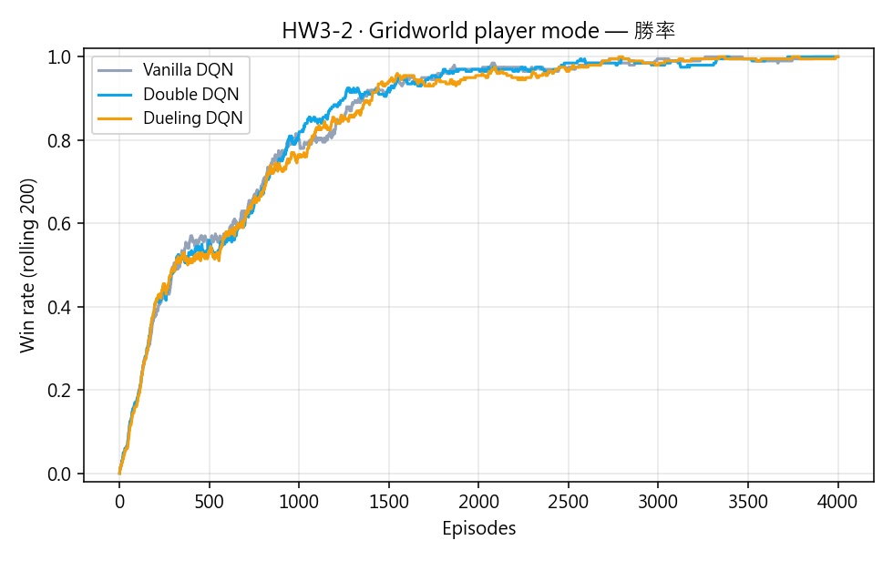
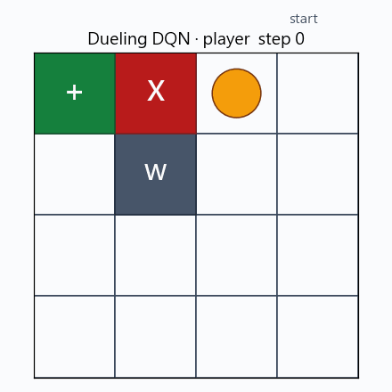
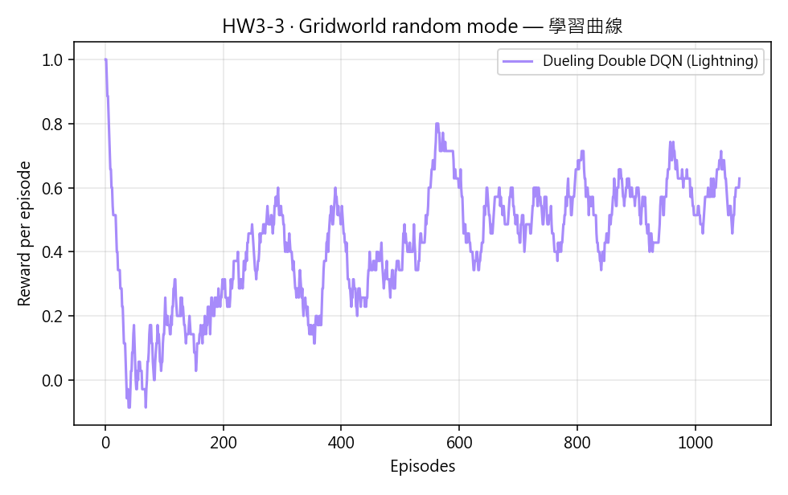
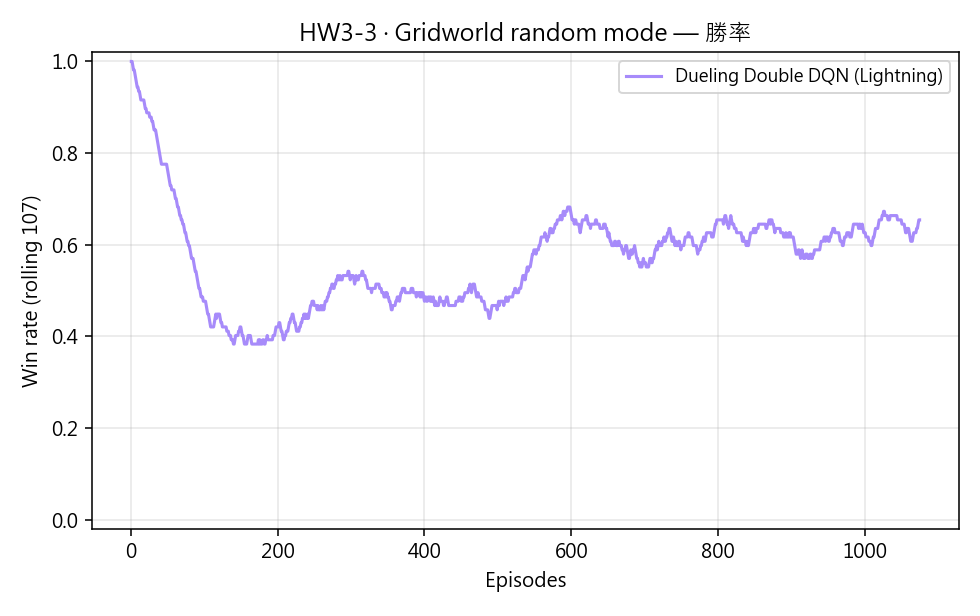
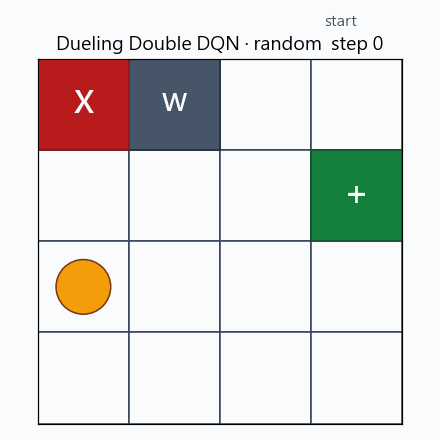

# HW3 — DQN 及其變體

DRL 作業 3。以 *Deep Reinforcement Learning in Action*（Brandon Brown, Alex Zai）
第三章的 Gridworld starter code 為基底，完成三個部分：

1. **HW3-1 (30%)：** Naive DQN + Experience Replay Buffer（`static` 模式）
2. **HW3-2 (40%)：** Double DQN 與 Dueling DQN（`player` 模式）
3. **HW3-3 (30%)：** 以 **PyTorch Lightning** 改寫 DQN，加入訓練穩定性技巧，
   並跑最難的 `random` 模式

**Live demo：** <https://oomao.github.io/HW3_DQN_and_its_variants/>

---

## 一、環境：Gridworld（4×4）

Gridworld 來自上游教科書的 `Environments/Gridworld.py`（MIT 授權），為避免
使用者另外 clone 上游 repo，本專案把環境程式碼 vendor 到
`src/hw3/gridworld_vendored.py`（檔頭附 attribution）。

- 4×4 網格，每格可能有四種物件：玩家 (Player)、目標 (Goal)、陷阱 (Pit)、
  牆壁 (Wall)。
- 狀態表示：`board.render_np()` 為 `(4, 4, 4)` 的 one-hot，攤平後加上
  `rand(1, 64)/100` 的微量雜訊（打破對稱、避免相同 state 反覆觸發相同輸出）。
- 動作：`{0:上, 1:下, 2:左, 3:右}`。
- 回饋：踩到 Goal +1（勝利）、踩到 Pit −1（失敗）、其他時 0；`reward≠0` 或
  `moves ≥ max_moves(=50)` 視為回合結束。

| 模式 | 物件位置 | 用途 |
|---|---|---|
| `static` | 全部固定 | 驗證邏輯正確 |
| `player` | 只有 Player 隨機 | 測泛化到不同起點 |
| `random` | 全部隨機 | 測泛化到任意關卡 |

## 二、HW3-1 ─ Naive DQN + Experience Replay（static）

### 設定

| 參數 | 值 |
|---|---|
| 網路 | `Linear(64→150→100→4)`（Listing 3.2） |
| Optimizer | Adam, lr=1e-3 |
| Loss | MSELoss |
| γ | 0.9 |
| ε schedule | 線性從 1.0 衰減到 0.1 |
| Replay capacity | 1000 |
| Batch size | 200 |
| Episodes | 3000 |

### 結果






有 replay 的版本最後 200 回合勝率 ≈ **0.99**，並能以 7 步從起點走到 goal。

### Short understanding report（對應題目要求）

- **為什麼需要 Replay Buffer？** 連續 step 產生的樣本高度相關，直接拿來更新
  網路會破壞 i.i.d. 假設；replay 讓我們從整個經驗分布均勻抽樣，更像
  supervised learning。同時，同一筆經驗可以被多次學習，大幅提升 data efficiency。
- **Q 目標怎麼算？** `target = r + γ · max_a' Q(s', a')`（done 時去掉
  bootstrap 項），以 `MSELoss` 對所選動作對應的 Q 值做迴歸。
- **ε-greedy 為什麼線性衰減？** 一開始必須探索，環境才會提供正向獎勵；
  學到雛形後再逐漸依賴自己的策略。終點保留 0.1 的噪音是為了避免完全卡在
  sub-optimal policy。

## 三、HW3-2 ─ Double DQN / Dueling DQN（player）

### 改進動機

| 改進 | 一句話解釋 |
|---|---|
| **Double DQN** | 用 online 網路「挑動作」、target 網路「估值」，緩解 $\max$ 造成的過度估計偏差 |
| **Dueling DQN** | 把 `Q(s,a)` 拆成 `V(s) + A(s,a)`，讓網路能明確地判斷「這個狀態本身多好」，對 Q 差距小的狀態特別有利 |

### 設定（除下列之外與 HW3-1 相同）

- Replay capacity 提升到 10000（player mode 經驗更多元）
- 額外維護 `target` 網路，每 500 env step 做 hard sync
- Episodes：4000

### 結果





三種變體在 player mode 最後 200 回合勝率皆收斂到 **1.00**。
從勝率曲線看 Double DQN 在訓練中段領先最明顯，三者最終皆穩定 — player mode
狀態空間小（僅 Player 位置變），足以讓 vanilla DQN 也學得很好。

## 四、HW3-3 ─ PyTorch Lightning + Training Tips（random）

### 為什麼要 Lightning？

原 starter 是純 PyTorch 的手刻 loop：agent 收 transition、push buffer、
sample、backward、sync target 全寫在同一個函式。改寫成 `LightningModule`
後：

- `training_step` 只關心「給一個 batch、回傳 loss」；
- 梯度裁剪、LR schedule、device 管理、checkpoint 都交給 `Trainer` 處理；
- 環境互動（收 transition）透過 `IterableDataset` 串流進來，每個 training step
  主動多收 1 筆資料推進 buffer。

### 加入的穩定性技巧

| 技巧 | 用途 | 本專案設定 |
|---|---|---|
| **梯度裁剪** (clip_grad_norm) | 限制梯度爆炸 | `gradient_clip_val=1.0` |
| **Cosine LR annealing** | 末期降低 lr 讓 Q 值細調 | 1e-3 → 1e-5 over `total_steps` |
| **Target soft update** | 比 hard sync 更穩 | `τ = 0.005`，每步 Polyak 更新 |
| **ε 指數衰減** | 前期快速探索、中期迅速收斂 | `ε = 0.05 + 0.95 · exp(-3 · t / 5000)` |
| **Warm-up buffer** | 避免過早更新造成偏誤 | buffer 累積 500 transition 後才開始 gradient step |
| **Dueling + Double** | 組合 HW3-2 的兩個改進 | — |

### 結果





Random mode 上限比 static/player 明顯低（有些隨機生成的局面幾乎無解，例如
Goal 被 Wall/Pit 困住），但最後 300 回合仍能維持 **勝率 ≥ 0.60** 的穩定表現。

## 五、專案結構

```
HW3_DQN_and_its_variants/
├── README.md                      # 本文件
├── requirements.txt
├── .gitignore                     # 忽略 .claude/、_upstream/
├── src/hw3/
│   ├── gridworld_vendored.py      # 教科書 Gridworld（MIT）
│   ├── env.py                     # numpy/torch 友善的 reset/step 包裝
│   ├── models.py                  # DQN、DuelingDQN、soft/hard update
│   ├── replay.py                  # ReplayBuffer
│   ├── train_naive.py             # HW3-1
│   ├── train_variants.py          # HW3-2
│   ├── train_lightning.py         # HW3-3
│   └── viz.py                     # 曲線 / GIF 工具
├── artifacts/                     # 訓練結果（.npy、.png、.gif、checkpoint）
├── docs/                          # GitHub Pages live demo
├── scripts/{startup,ending}.sh
└── openspec/                      # 三個 change（已 archive）
```

## 六、重現步驟

```bash
python -m pip install -r requirements.txt

# HW3-1：2 分鐘內
PYTHONPATH=src python -m hw3.train_naive      --episodes 3000 --seed 0

# HW3-2：4 分鐘內
PYTHONPATH=src python -m hw3.train_variants   --episodes 4000 --mode player --seed 0

# HW3-3：6-10 分鐘（Lightning 有額外 overhead）
PYTHONPATH=src python -m hw3.train_lightning  --steps 12000 --mode random --seed 0
```

## 七、參考資料

- Brandon Brown, Alex Zai. *Deep Reinforcement Learning in Action*. Chapter 3.
  [Source code](https://github.com/DeepReinforcementLearning/DeepReinforcementLearningInAction)
- Van Hasselt et al., *Deep Reinforcement Learning with Double Q-learning*, AAAI 2016.
- Wang et al., *Dueling Network Architectures for Deep Reinforcement Learning*, ICML 2016.
