# HW3 — DQN 及其變體

DRL 作業 3。以 *Deep Reinforcement Learning in Action*（Brandon Brown, Alex Zai）
第三章的 Gridworld starter code 為基底，完成四個部分：

1. **HW3-1 (30%)：** Naive DQN + Experience Replay Buffer（`static` 模式）
2. **HW3-2 (40%)：** Double DQN 與 Dueling DQN（`player` 模式）
3. **HW3-3 (30%)：** 以 **PyTorch Lightning** 改寫 DQN，加入訓練穩定性技巧，
   並跑最難的 `random` 模式（本專案利用 RTX 4090 CUDA 加速）
4. **HW3-4（加分題）：** **Rainbow DQN**（六個改進 Double / Dueling / PER /
   n-step / Distributional C51 / NoisyNet 全部實作 + 完整 ablation 表）

**Live demo：** <https://oomao.github.io/HW3_DQN_and_its_variants/>

---

## 一、環境：Gridworld（4×4）

Gridworld 來自上游教科書的 `Environments/Gridworld.py`（MIT 授權），為避免
使用者另外 clone 上游 repo，本專案把環境程式碼 vendor 到
`src/hw3/gridworld_vendored.py`（檔頭附 attribution）。

- 4×4 網格，每格可能有四種物件：玩家 (Player)、目標 (Goal)、陷阱 (Pit)、
  牆壁 (Wall)。
- 狀態表示：`board.render_np()` 為 `(4, 4, 4)` 的 one-hot，攤平後加上
  `rand(1, 64)/100` 的微量雜訊（打破對稱、避免相同 state 反覆觸發相同輸出）。
- 動作：`{0:上, 1:下, 2:左, 3:右}`。
- 回饋：踩到 Goal +1（勝利）、踩到 Pit −1（失敗）、其他時 0；`reward≠0` 或
  `moves ≥ max_moves(=50)` 視為回合結束。

| 模式 | 物件位置 | 用途 |
|---|---|---|
| `static` | 全部固定 | 驗證邏輯正確 |
| `player` | 只有 Player 隨機 | 測泛化到不同起點 |
| `random` | 全部隨機 | 測泛化到任意關卡 |

## 二、HW3-1 ─ Naive DQN + Experience Replay（static）

### 設定

| 參數 | 值 |
|---|---|
| 網路 | `Linear(64→150→100→4)`（Listing 3.2） |
| Optimizer | Adam, lr=1e-3 |
| Loss | MSELoss |
| γ | 0.9 |
| ε schedule | 線性從 1.0 衰減到 0.1 |
| Replay capacity | 1000 |
| Batch size | 200 |
| Episodes | 3000 |

### 結果

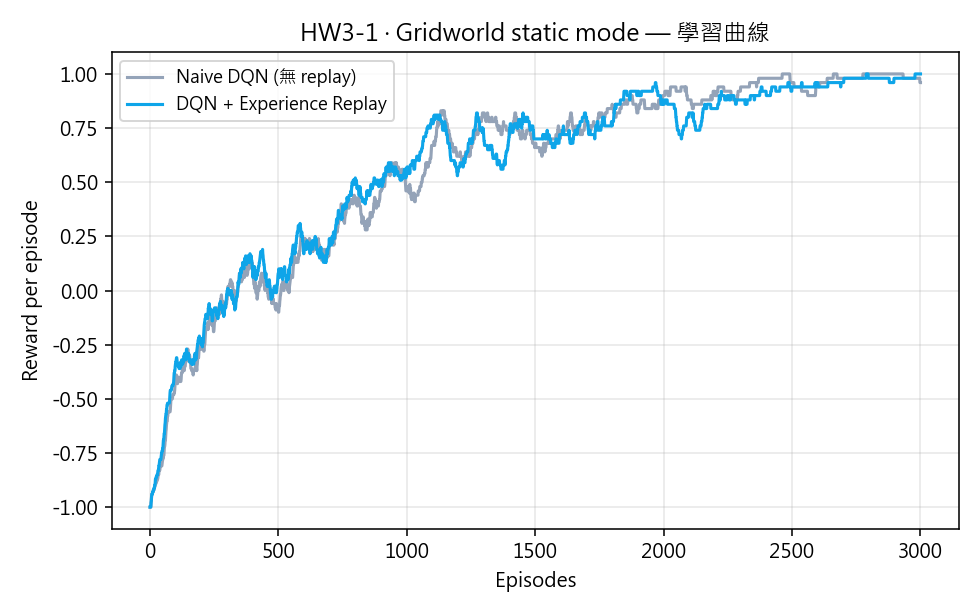
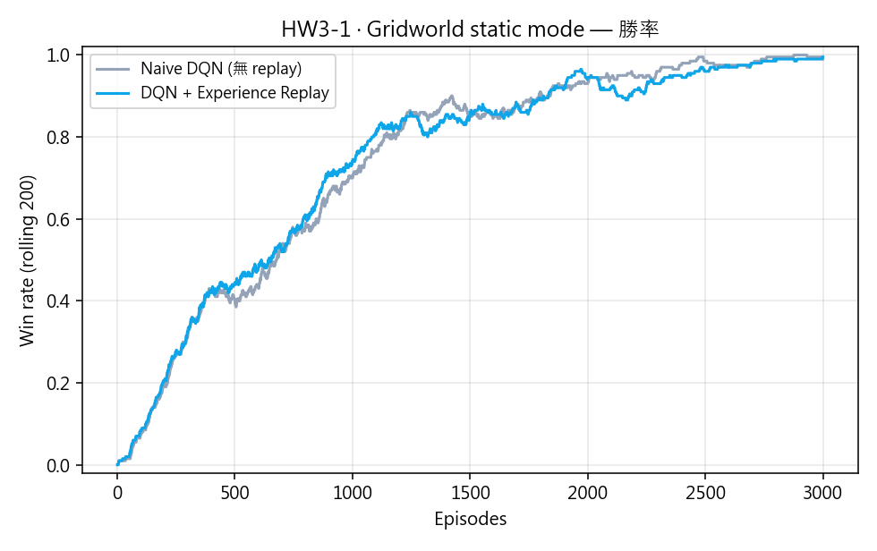

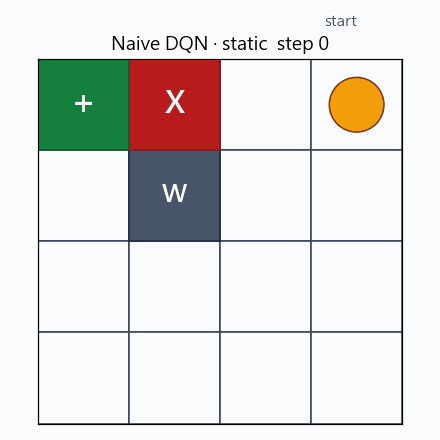

有 replay 的版本最後 200 回合勝率 ≈ **0.99**，並能以 7 步從起點走到 goal。

### Short understanding report（對應題目要求）

- **為什麼需要 Replay Buffer？** 連續 step 產生的樣本高度相關，直接拿來更新
  網路會破壞 i.i.d. 假設；replay 讓我們從整個經驗分布均勻抽樣，更像
  supervised learning。同時，同一筆經驗可以被多次學習，大幅提升 data efficiency。
- **Q 目標怎麼算？** `target = r + γ · max_a' Q(s', a')`（done 時去掉
  bootstrap 項），以 `MSELoss` 對所選動作對應的 Q 值做迴歸。
- **ε-greedy 為什麼線性衰減？** 一開始必須探索，環境才會提供正向獎勵；
  學到雛形後再逐漸依賴自己的策略。終點保留 0.1 的噪音是為了避免完全卡在
  sub-optimal policy。

## 三、HW3-2 ─ Double DQN / Dueling DQN（player）

### 改進動機

| 改進 | 一句話解釋 |
|---|---|
| **Double DQN** | 用 online 網路「挑動作」、target 網路「估值」，緩解 $\max$ 造成的過度估計偏差 |
| **Dueling DQN** | 把 `Q(s,a)` 拆成 `V(s) + A(s,a)`，讓網路能明確地判斷「這個狀態本身多好」，對 Q 差距小的狀態特別有利 |

### 設定（除下列之外與 HW3-1 相同）

- Replay capacity 提升到 10000（player mode 經驗更多元）
- 額外維護 `target` 網路，每 500 env step 做 hard sync
- Episodes：4000

### 結果

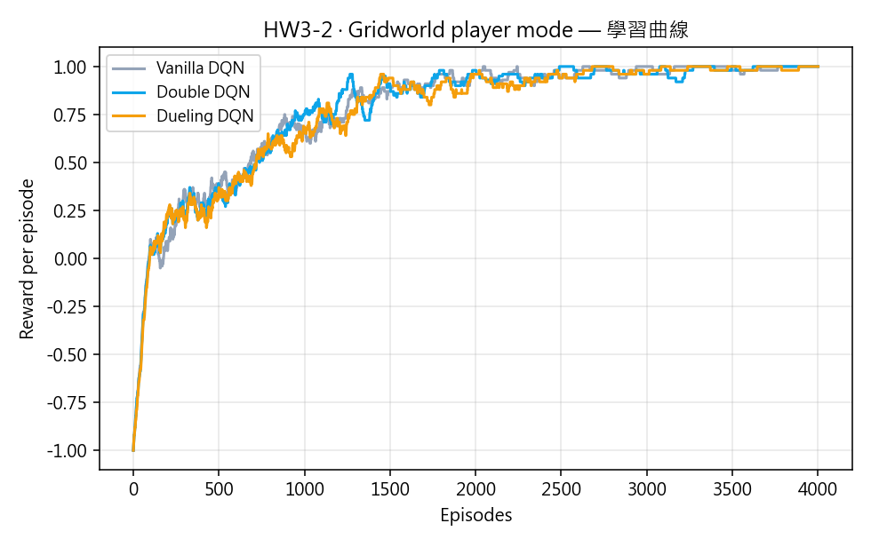
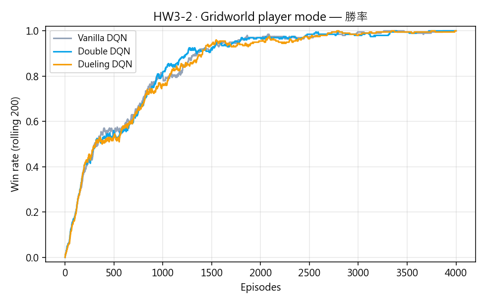
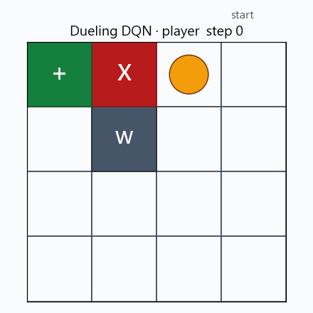

三種變體在 player mode 最後 200 回合勝率皆收斂到 **1.00**。
從勝率曲線看三者最終皆穩定，訓練中段 Double DQN 略為領先 — player mode
狀態空間小（僅 Player 位置變），足以讓 vanilla DQN 也學得很好。

## 四、HW3-3 ─ PyTorch Lightning + Training Tips（random）

### 為什麼要 Lightning？

原 starter 是純 PyTorch 的手刻 loop：agent 收 transition、push buffer、
sample、backward、sync target 全寫在同一個函式。改寫成 `LightningModule`
後：

- `training_step` 只關心「給一個 batch、回傳 loss」；
- 梯度裁剪、LR schedule、device 管理、checkpoint 都交給 `Trainer` 處理；
- 環境互動（收 transition）透過 `IterableDataset` 串流進來，每個 training step
  主動多收 1 筆資料推進 buffer；
- 只要 `--accelerator gpu` 就能自動用 CUDA（本專案於 RTX 4090 實測）。

### 加入的穩定性技巧

| 技巧 | 用途 | 本專案設定 |
|---|---|---|
| **梯度裁剪** (clip_grad_norm) | 限制梯度爆炸 | `gradient_clip_val=1.0` |
| **Cosine LR annealing** | 末期降低 lr 讓 Q 值細調 | 1e-3 → 1e-5 over `total_steps` |
| **Target soft update** | 比 hard sync 更穩 | `τ = 0.005`，每步 Polyak 更新 |
| **ε 指數衰減** | 前期快速探索、中期迅速收斂 | `ε = 0.05 + 0.95 · exp(-3 · t / 3000)` |
| **Warm-up buffer** | 避免過早更新造成偏誤 | buffer 累積 500 transition 後才開始 gradient step |
| **Dueling + Double** | 組合 HW3-2 的兩個改進 | — |

### 結果（25000 steps · RTX 4090 CUDA · ~3 分鐘）

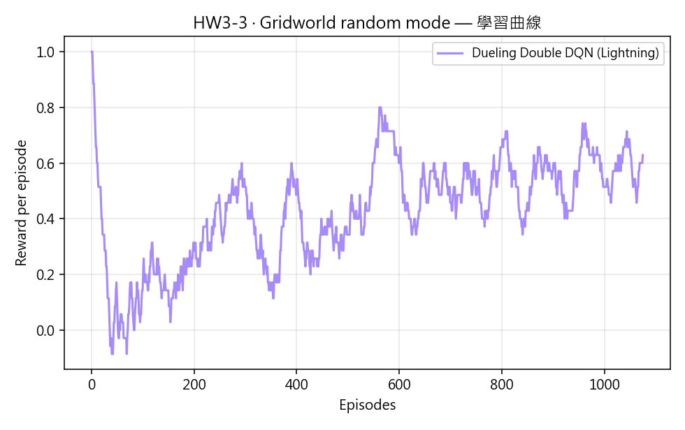
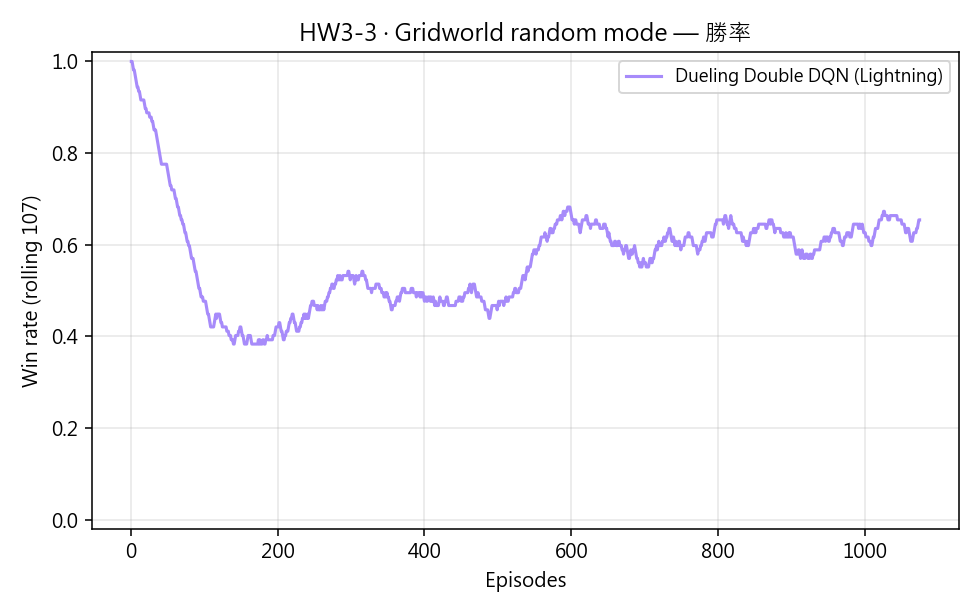
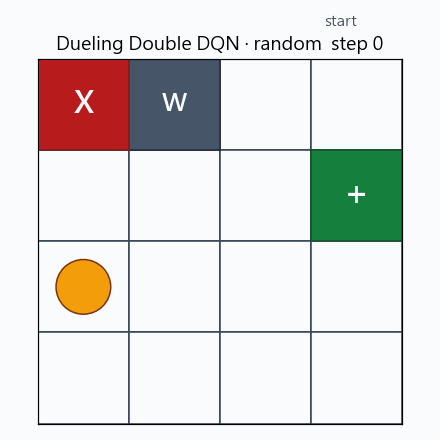

Random mode 上限比 static/player 明顯低（有些隨機生成的局面幾乎無解，例如
Goal 被 Wall/Pit 困住），但最後 300 回合仍能穩定維持 **勝率 ≈ 0.64**。

## 五、HW3-4（加分題） ─ Rainbow DQN（random）

> 老師的提示：static 用基本款、player 解不出來要用「高級」、random 能解就好。
> HW3-3 的 Dueling Double DQN 在 random mode 已達 0.64；HW3-4 把整個 **Rainbow
> 家族 6 個改進全部實作出來**，並用嚴謹 ablation 找出哪些真的有效。

### Rainbow 是什麼？六個改進都實作了

Rainbow（Hessel et al., 2018）把六個 DQN 改進塞進同一個 agent：

| # | 改進 | 本專案實作位置 |
|---|---|---|
| 1 | Double DQN | HW3-2/3 已有；HW3-4 沿用 |
| 2 | Dueling DQN | HW3-2/3 已有；HW3-4 沿用 |
| 3 | **Prioritized Experience Replay (PER)** | `src/hw3/prioritized_replay.py`（sum-tree）|
| 4 | **Multi-step / n-step return** | `src/hw3/nstep.py` |
| 5 | **Distributional RL (C51)** | `models.py::CategoricalRainbowDQN` + `project_distribution` |
| 6 | **Noisy Networks** | `models.py::NoisyLinear` |

`src/hw3/train_rainbow.py` 用兩個 flag 任意組合：`--no-distributional`（關掉
C51）與 `--noisy`（打開 NoisyNet）。**6/6 完整 Rainbow 用 `--noisy` 即可**；
這也是 ablation 跑得起來的關鍵。

### 設定（基準：HW3-3 Lightning）

| 參數 | HW3-3 | HW3-4 |
|---|---|---|
| 網路 | DuelingDQN | `CategoricalRainbowDQN`（C51, 51 atoms, V ∈ [−1, 1]）|
| Replay | uniform deque(10000) | **Prioritized**（sum-tree, α=0.6, β: 0.4→1.0）|
| Target horizon | 1-step | **3-step n-step return**（`r_t + γr_{t+1} + γ²r_{t+2} + γ³ Q_target`）|
| Loss | MSE | **Cross-entropy on projected distribution**（C51）/ Huber + IS-weight（非 C51）|
| 探索 | ε 指數衰減 | ε 指數衰減（同；NoisyNet 為 ablation）|
| Optimizer | Adam lr=1e-3 + Cosine→1e-5 | 同 |
| Steps / batch / γ / τ | 25000 / 128 / 0.9 / 0.005 | 同 |

### Ablation 主結果

對五種配置都跑 25k env step、seed=0、其他超參一致：

| 配置 | Rainbow 元件 | episodes / 25k steps | last-300 win rate |
|---|---:|---:|---:|
| HW3-3 · Dueling Double DQN（baseline） | 2/6 | 1074 | 0.643 |
| **Rainbow 4/6**（+ PER + n=3）✨ best | **4/6** | **1224 (+14%)** | **0.653** |
| Rainbow 5/6（+ C51） | 5/6 | 950 | 0.313 |
| Rainbow 5/6（+ NoisyNet） | 5/6 | 812 | 0.367 |
| Rainbow 6/6（full） | 6/6 | 706 | 0.133 |

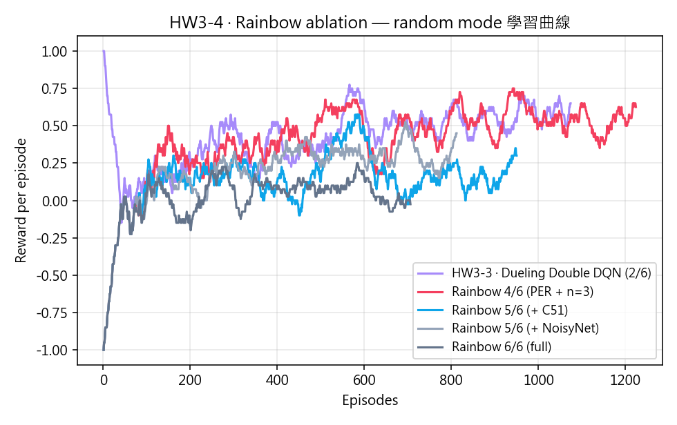
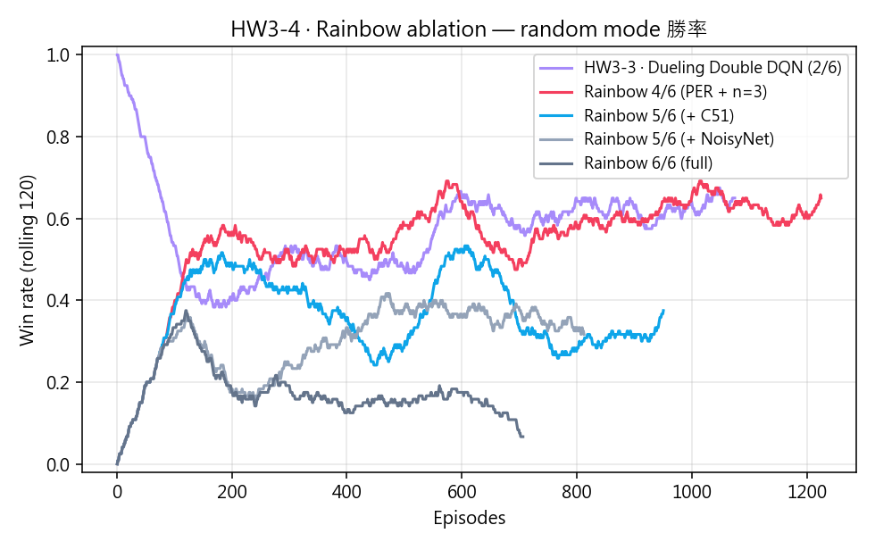

**結論：在 4×4 toy random gridworld 上，只有 PER + n-step（4/6 配置）真的有效；
加上 C51 或 NoisyNet 反而傷害效能，全 6/6 最差。** 這個發現呼應原始 Rainbow
paper 在 Atari 較簡單關卡上的觀察 — distributional 與 NoisyNet 的好處主要來自
高維、reward 多模態的環境。對 reward ∈ {−1, 0, +1}、state 只有 16 個 player 位
置變化的 toy env，這兩個技巧反而引入太多 variance。

### 最佳配置（4/6）的展示

下圖為 4/6 配置訓練完成後的學習曲線、勝率與 rollout（seed=99，**7 步抵達 goal**）：

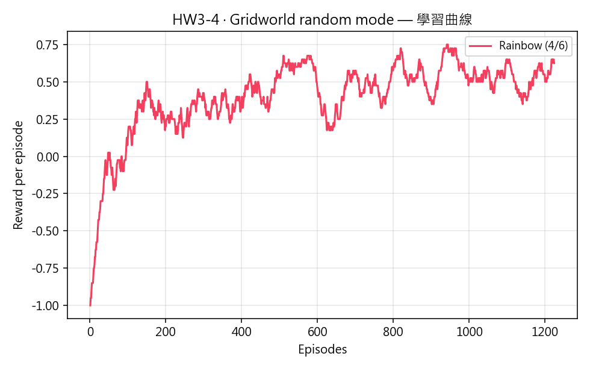
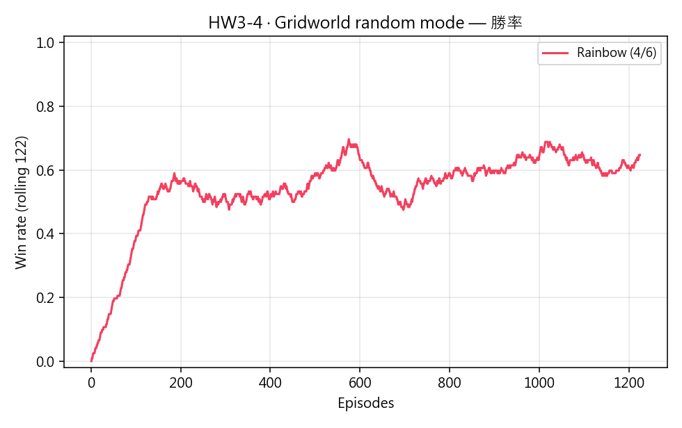

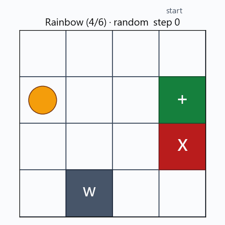

PER + n-step 的最關鍵指標不是勝率（只小幅推升 0.643 → 0.653），而是**同樣 25k
env step 跑完 1224 個回合，比 baseline 多 14%** — 平均每回合 step 更少 →
策略更直接、bootstrap 訊號傳遞更有效率。

### 為什麼 C51 在這個 env 變差？

C51 把 Q 從一個純量改成 51 個 atom 上的機率分布（V ∈ [−1, 1]）。在 Atari 那種
reward 多模態的環境很有用，但在這個 toy env：

1. **Reward 退化**：reward ∈ {−1, 0, +1}，加上 γ=0.9、n=3 的 n-step return 也只
   在 [−1, 1] 內。實際只有約 5–10 個 atom 有非零機率，剩下 41–46 個 atom 純粹
   是浪費的參數，增加 gradient noise。
2. **Cross-entropy gradient scale 不同**：C51 用 KL/CE loss，而 MSE/Huber 是回
   歸目標。同樣的 net + lr 下，CE 的梯度尺度與我們調好的 lr cosine schedule
   不太搭，學習初期不穩。
3. **PER priority signal 變奇怪**：non-distributional 版本拿 `|TD-error|` 當
   priority，意義明確；C51 拿 cross-entropy 當 priority，數值範圍與 episode
   階段強相關，容易讓 PER 在訓練中段過度集中於某類局面。

### 為什麼 NoisyNet 在這個 env 變差？

1. **狀態空間太小 → 共享權重 noise 過度相關**：4×4 random gridworld 的有效
   feature 模式很少，NoisyLinear 對整個 batch 共用權重擾動 → 所有狀態的 Q 同
   方向偏移，等於把探索性塞進了 credit assignment。
2. **σ 學成後回不去**：σ 是 learnable parameter，可能不收斂；ε-greedy 的衰減
   是時間決定論式的，保證末期低噪音。
3. **PER 放大這個問題**：被 noise 隨機誤判而吃 pit 的 transition 會獲得極高
   priority，反覆抽樣，把網路推向「在 noise 下也撐得住」的方向 — 但測試時
   noise 已關閉，於是表現掉。

兩者疊加（6/6 full Rainbow）→ 雪上加霜，勝率掉到 0.13。

### Short understanding report

- **PER 為何有效？** 它讓 Goal/Pit 附近、TD-error 大的 transition 被重複學習；
  普通 deque 對「常見但無關緊要」的 transition 一視同仁，浪費 gradient budget。
- **n-step 怎麼影響穩定性？** 將 bootstrap 視野從 1 拉長到 n=3，「最後一步」
  的 reward 可以在 3 步內傳到第一個動作的 Q 上，避免 random mode 中長
  trajectory 全部 reward=0 的情況。代價是 off-policy bias（n-step 中動作是用
  「當時的舊 policy」抽的），但實作上 n=3 + Double DQN 可以容忍。
- **IS-weight 為什麼必要？** PER 改變了抽樣分布；不加 IS-weight 等於用 biased
  估計最佳化，會把網路推向高優先度區域而忽略整體期望。`β` 從 0.4 線性 anneal
  到 1.0 → 訓練初期容忍 bias 換取效率，末期把 bias 完全修掉。
- **C51 projection 在做什麼？** 把 Bellman update 後的 atom 位置（連續實數）
  以線性內插的方式攤回離散的 atom support，使新分布仍能用 cross-entropy 計算
  loss。Edge case：當 b 剛好是整數時，l == u，要特別處理避免機率質量歸零（程
  式碼裡用 `eq_mask` 修正）。
- **「全部都疊」不一定最好**：這次 ablation 證實了這個直覺 — 在低維離散
  reward 的 toy env，越複雜的 trick 越容易引入 variance；老師「random 能解就
  好」的提示其實點出了這個道理。

## 六、專案結構

```
HW3_DQN_and_its_variants/
├── README.md                      # 本文件
├── requirements.txt
├── .gitignore                     # 忽略 .claude/、_upstream/、lightning_logs/
├── src/hw3/
│   ├── gridworld_vendored.py      # 教科書 Gridworld（MIT）
│   ├── env.py                     # numpy/torch 友善的 reset/step 包裝
│   ├── models.py                  # DQN、DuelingDQN、NoisyLinear、RainbowDQN、CategoricalRainbowDQN、project_distribution
│   ├── replay.py                  # 普通 ReplayBuffer
│   ├── prioritized_replay.py      # PER（sum-tree, α/β anneal）
│   ├── nstep.py                   # n-step transition 累積器（含 episode-end flush）
│   ├── train_naive.py             # HW3-1
│   ├── train_variants.py          # HW3-2
│   ├── train_lightning.py         # HW3-3
│   ├── train_rainbow.py           # HW3-4
│   └── viz.py                     # 曲線 / GIF 工具
├── artifacts/                     # 訓練結果（.npy、.png、.gif、checkpoint）
├── docs/                          # GitHub Pages live demo
├── scripts/{startup,ending}.sh
└── openspec/                      # 四個 change（已 archive）
```

## 七、重現步驟

```bash
python -m pip install -r requirements.txt

# HW3-1：2 分鐘內（CPU）
PYTHONPATH=src python -m hw3.train_naive      --episodes 3000 --seed 0

# HW3-2：4 分鐘內（CPU）
PYTHONPATH=src python -m hw3.train_variants   --episodes 4000 --mode player --seed 0

# HW3-3：約 3 分鐘（RTX 4090 CUDA）或 1.5 分鐘（CPU, 6000 steps）
PYTHONPATH=src python -m hw3.train_lightning  --steps 25000 --mode random --seed 0 --accelerator gpu

# HW3-4（加分題）：每組約 2.5–3 分鐘（RTX 4090 CUDA）
# 4/6 = 最佳實測配置（PER + n-step + Dueling + Double，不含 C51/NoisyNet）
PYTHONPATH=src python -m hw3.train_rainbow --steps 25000 --mode random --seed 0 --accelerator gpu --no-distributional --tag rainbow_lite
# 5/6 = + C51（distributional） — 預設配置
PYTHONPATH=src python -m hw3.train_rainbow --steps 25000 --mode random --seed 0 --accelerator gpu --tag rainbow_c51
# 5/6 = 4/6 + NoisyNet 替代 ε-greedy
PYTHONPATH=src python -m hw3.train_rainbow --steps 25000 --mode random --seed 0 --accelerator gpu --no-distributional --noisy --tag rainbow_lite_noisy
# 6/6 = 完整 Rainbow（C51 + NoisyNet）
PYTHONPATH=src python -m hw3.train_rainbow --steps 25000 --mode random --seed 0 --accelerator gpu --noisy --tag rainbow_full
```

## 八、參考資料

- Brandon Brown, Alex Zai. *Deep Reinforcement Learning in Action*. Chapter 3.
  [Source code](https://github.com/DeepReinforcementLearning/DeepReinforcementLearningInAction)
- Van Hasselt et al., *Deep Reinforcement Learning with Double Q-learning*, AAAI 2016.
- Wang et al., *Dueling Network Architectures for Deep Reinforcement Learning*, ICML 2016.
- Schaul et al., *Prioritized Experience Replay*, ICLR 2016.
- Sutton & Barto, *Reinforcement Learning: An Introduction* (2nd ed.), Ch. 7（n-step Bootstrapping）.
- Bellemare, Dabney, Munos, *A Distributional Perspective on Reinforcement Learning*, ICML 2017（C51）.
- Fortunato et al., *Noisy Networks for Exploration*, ICLR 2018.
- Hessel et al., *Rainbow: Combining Improvements in Deep Reinforcement Learning*, AAAI 2018.
